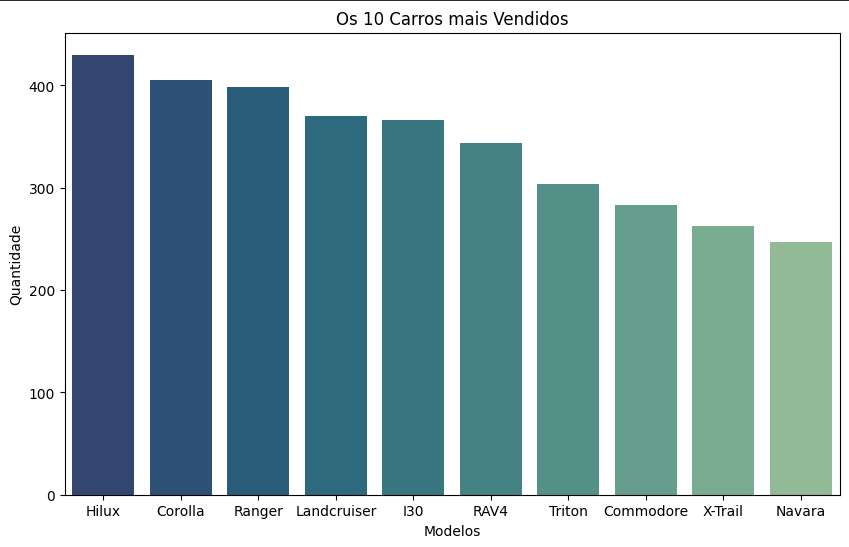
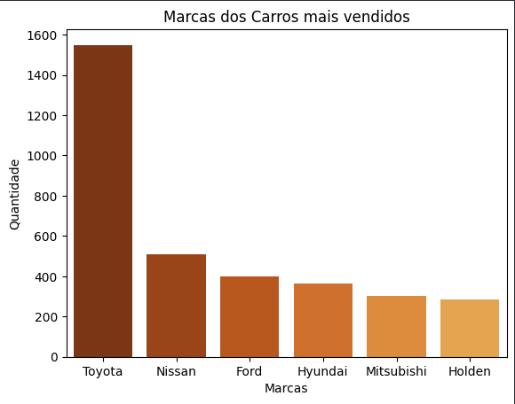

# Projeto de Análise e Exploração de Dados dos Veiculos vendidos na Austrália em 2023 
Projeto para por em pratica tudo que foi aprendido no curso de Data Science: Análise e Visualização de Dados da Alura

  

 

  <h2>O que foi feito nesse projeto?</h2>
  Nesse primeiro projeto peguei uma base de dados do Kaggle que é sobre os Veículos vendidos na Austrália no ano de 2023, essa é uma base rica de dados que podemos explorar das mais derivadas formas, porem para esse início comecei focando nos Carros mais vendidos do ano, assim montando dois gráficos de barras, um sendo dos 10 Carros mais vendidos no ano, e o outro das marcas desses 10 Carros que mais se popularizaram durante o ano, com isso conseguimos tirar alguns insights pelos gráficos e também por outras visualizações e tratamento de dados feitos com essa base.
  

    <h2>Grafico dos 10 Carros mais Vendidos de 2023 na Austrália</h2> 
    
  

  

    <h2>Grafico das Marca que mais Venderam Carros em 2023 na Austrália</h2> 
    
  

